# [研究室推奨] VScode (DevContainer) +GitHubでLaTeX論文執筆

山田宏樹研究室では，LaTeXでの論文執筆の際に必ずgitを使ったバージョン管理を行い，研究室のGitHub Organizationにリポジトリを作ってもらっています．
これは，以下の狙いがあるためです．
1. 原稿のバックアップをとる
1. 原稿執筆の進捗を把握しやすくする
1. 原稿を誰でも見れるようにしておくことで，LaTeX の書き方を学びやすくする
1.  研究室全体で原稿の添削をできるようにする
1. 各原稿に対しどのような添削・コメントがなされているかを確認しやすくする

> [!NOTE]
> LaTeXのエディタとしてoverleafのようなブラウザからlatexの原稿を執筆できるサービスもありますが，git連携が有料であったり研究室全体で原稿の添削をするということがしづらいため，overleafは使わない方針にしています．

この記事ではLaTeXの環境をVScodeとGitHubで簡単に構築するための方法を説明します．

（参考にした記事：[DevContainerで始めるLaTeX論文執筆](https://zenn.dev/lirais/articles/6b28a6b1c3e918)）

## 必要な環境
- Docker Desktop
- Visual studio code
- VScodeの拡張機能の`DevContainers`をインストール
- Git
- GitHub CLI

これらのインストール方法は[DevContainerで始めるLaTeX論文執筆](https://zenn.dev/lirais/articles/6b28a6b1c3e918)にまとまっているので参考にしてください．
gitとGitHub CLIは公式ページにインストール方法が記載されています．

[gitの公式サイト](https://git-scm.com/downloads)
[GitHub CLIの公式サイト](https://cli.github.com/)

### 初めてgitをインストールした方へ
初めてgitをインストールした人は[このページ](https://docs.github.com/ja/get-started/getting-started-with-git/set-up-git)の`Gitをセットアップする`と`GitからのGitHubによる認証`を読んでセットアップしてください．`GitからのGitHubによる認証`のところでは，SSHではなく`HTTPSで接続`にしてください．`gh auth login`を使った認証方法は[この記事](https://techblog.ap-com.co.jp/entry/2021/08/23/091131)を参考にしてください．


## GitHub OrganizationにあるLaTeX用テンプレートから環境を構築する
本研究室のGitHub Organizationには日本語用と英語用のLaTeX用テンプレートレポジトリを用意しています．
- 日本語用：latex_ja_devcontainer_template
- 英語用：latex_en_devcontainer_template

これから先は日本語用のLaTeX用テンプレートを例に説明しますが，やり方は同じです．

### 1. LaTeX用テンプレートのレポジトリに移動して右上の`Use this template`をクリック

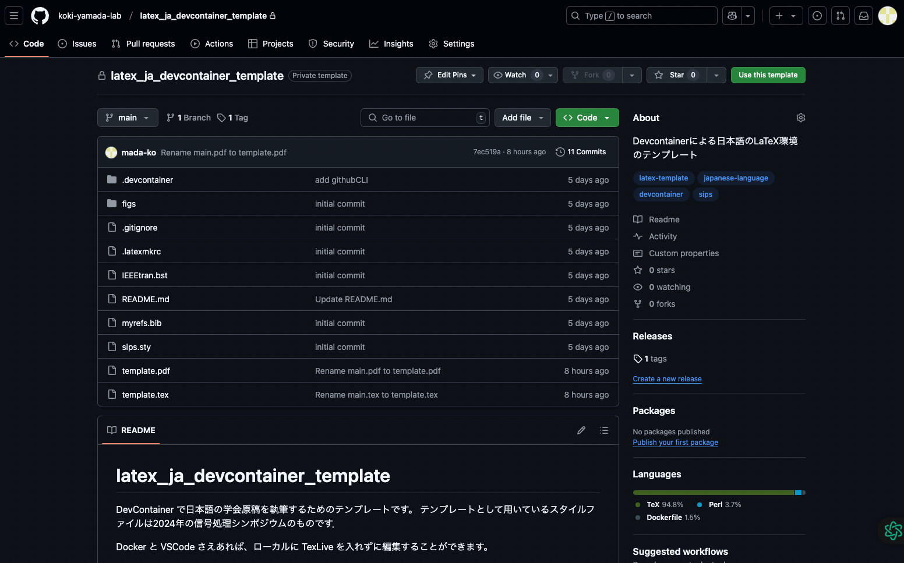

### 2. レポジトリ名を入力してリポジトリを作る

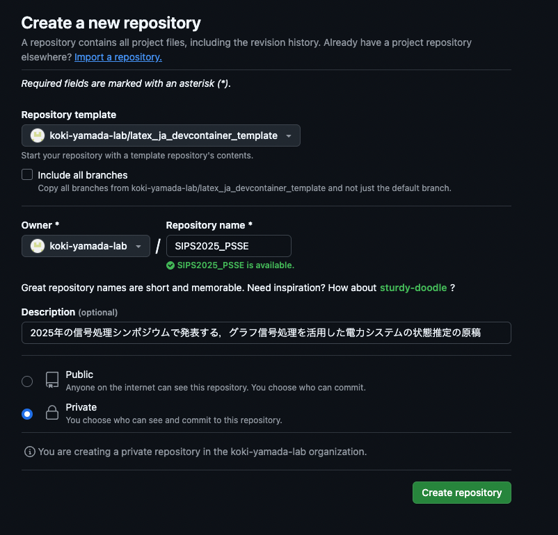

リポジトリ名をRepository nameのところに記載してリポジトリを作る．
リポジトリ名は学会原稿の場合は「**学会名+年-論文の簡単な名称**」としてください．
例：2025年の信号処理シンポジウムで電力システムの状態推定 (PSSE: Power System State Estimation) の原稿を書くときには`SIPS2025_PSSE`とする．
include all branchesにはチェックを入れなくていいです．
Descriptionのところにはリポジトリの説明を書いておきましょう．
例）2025年の信号処理シンポジウムで発表する，グラフ信号処理を活用した電力システムの状態推定の原稿

> [!CAUTION]
>**必ずPrivateを選択する**こと．Publicにしてしまうとこれから作るレポジトリが誰でも見られるようになってしまい，研究のアイデアが流出する可能性があるので，絶対Publicにはしない．

### 3. リポジトリのフォルダ構成
出来上がったリポジトリ
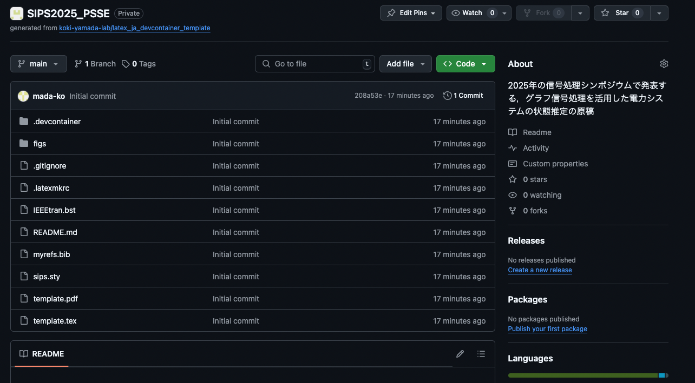

`figs/`は論文に挿入するfigureを置くフォルダ 
`.devcontainer`はdockerで環境構築するための設計図が格納されているフォルダ
`.gitignore`はgitでLaTeXの中間ファイルをトラッキングしないように設定するファイル．
`.latexmkrc`は日本語用のLaTeX設定をするためのファイル．

### 4. ローカル環境にリポジトリを複製する

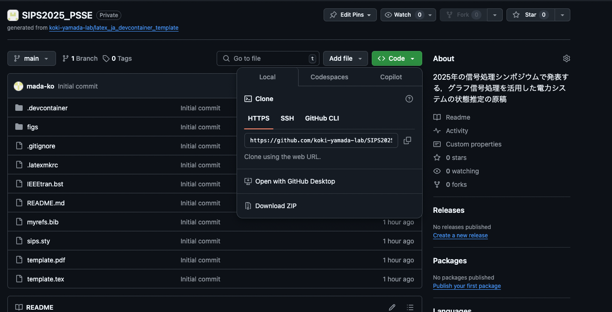

リポジトリの緑の`Code`をクリックするとリポジトリのURLをコピーできる．
GitHubの認証はHTTPSで行っているのでHTTPSを選んでコピー．
自身のPCでリポジトリを配置したいディレクトリで`git clone <コピーしたURL>`を実行する
```shell
git clone https://github.com/koki-yamada-lab/SIPS2025_PSSE.git
```
成功するとこんな感じのメッセージが出る．
```shell
yamadakoki@MacBook-Pro-2021 Documents % git clone https://github.com/koki-y
amada-lab/SIPS2025_PSSE.git
Cloning into 'SIPS2025_PSSE'...
remote: Enumerating objects: 16, done.
remote: Counting objects: 100% (16/16), done.
remote: Compressing objects: 100% (15/15), done.
remote: Total 16 (delta 0), reused 14 (delta 0), pack-reused 0 (from 0)
Receiving objects: 100% (16/16), 386.77 KiB | 10.18 MiB/s, done.

```

`git clone`に成功したら，リポジトリが複製できているはずなので，そのディレクトリに移動しVScodeで開く
> [!TIP]
> ターミナルでそのディレクトリに移動して，`code .`を実行するとカレントディレクトリでVScodeが開ける．

### 5. VScodeからDevContainerを開く
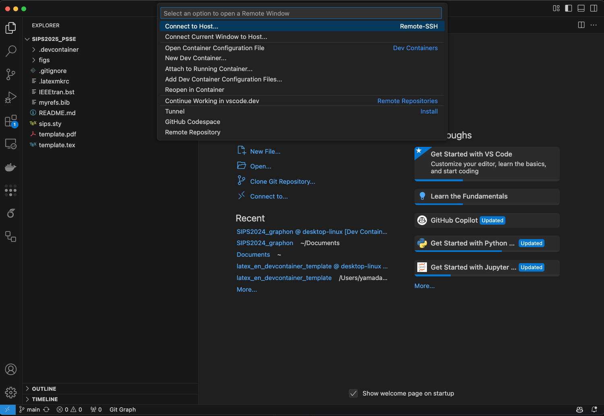

この画像の左下の青い`><`をクリックするとコマンドパレットが開くので，`Reopen in Container`をクリックする．
そうすると，VScodeで新しいウィンドウが立ち上がる．

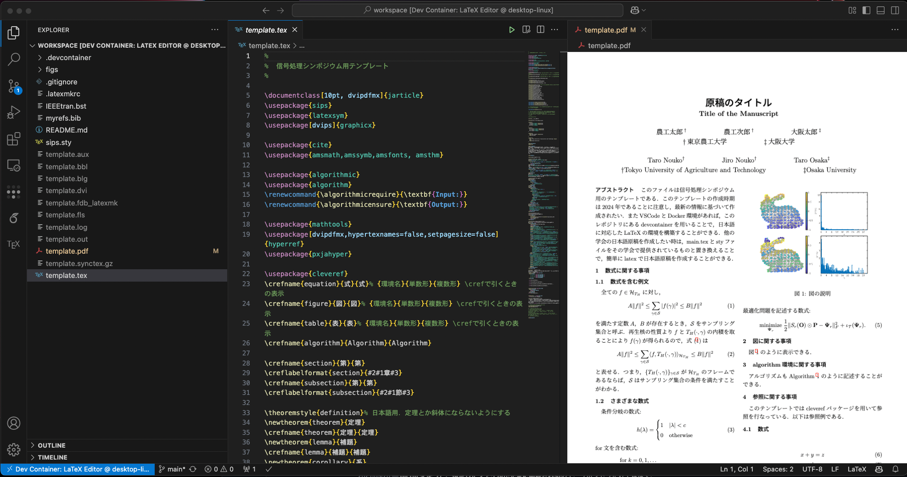

`template.tex`を開き緑の▷をクリックするとtexファイルが実行されコンパイルされる．
問題なく実行できれば，日本語のLaTeX環境が構築完了！

Windows環境であれば`Ctrl + Alt + B`でコンパイル、`Ctrl + Alt + V`でエディタの右半分に出力されたPDFファイルを出すことができます。(上の画像のように)
また、texファイルに変更があると自動でコンパイルが走るようになっている (はず) なので、プロジェクトを作成して最初のコンパイル以外は気にしなくていいです。(2025/12/17 舘澤追記)

> [!TIP]
> texファイルをコンパイルするとたくさん中間ファイルが出来上がるが気にしなくて良い．生成された中間ファイルは`.gitignore`でgit管理しないように設定している．

### 5. DevContainerから論文執筆
基本的に学会あるいは論文誌はLaTeX用のテンプレートを配布しているので，スタイルファイル (拡張子が.sty) やクラスファイル (.cls) をそのテンプレートに入ってるものと置き換えれば使えるはず（多少の調整が必要にはなるかもしれないが）．ちなみに元々入っているtemplate.texは2024年にダウンロードした信号処理シンポジウムのテンプレートである．このテンプレートは`sips.sty`によってtexのフォーマットが決められています．

LaTeXで執筆するときは，原稿の名前を`main.tex`とすることが多いので，`main.tex`というファイルに執筆しましょう．
> [!TIP]
> 原稿を書き始めたら`template.tex`，`template.pdf`などはいらなくなると思います．そのときは`git rm`コマンドを使ってファイルを削除しましょう．

#### VScodeでのgitの使い方
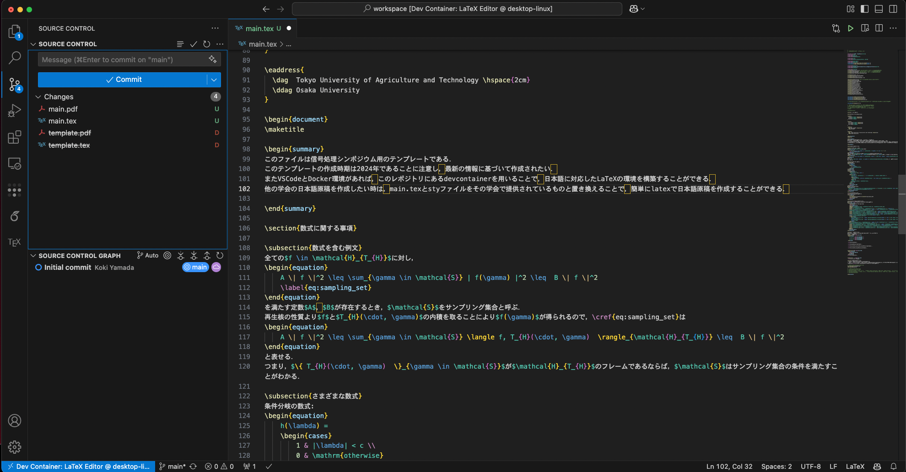

原稿を書き始めたら，こまめにcommitして，リモートリポジトリにプッシュしましょう．そうすることで，GitHubのリポジトリに変更が保存されバックアップがとられた状態になります．VScodeでは，左側にあるSource controlから簡単にgitの操作ができます．VScodeでのgitの使い方は[こちら](https://zenn.dev/praha/articles/db1c4bcc4ef48c)を参考にしてください．
GitHub Copilotを入れておけば自動でcommit messageも生成してくれます（画像の青い`Commit`の上のMessageの右にある二つ星のマークをクリックするとcommit messageを生成してくれる）．
GitHub Copilotを入れておくと何かと便利なのでどんどん活用しましょう！

### 6. Pull requestを活用した論文添削

（参考：[GitHub Pull Request をもちいた論文レビュー添削のすゝめ](https://cysec.ise.ritsumei.ac.jp/2024/01/14/review-paper-via-github-pull-request/)

原稿の初稿が出来上がったら，pull requestをして論文添削をします．
pull requestを使って論文を添削する理由は以下の通りです．
1. 複数人でコメントを入れることができる．
1. 他のレビュアーのコメントが閲覧でき，コメントの重複を避けることができる．
1. Suggestion機能で，修正案を提案できる．
1. 解決済みマークで修正済みか判別できる．

#### Pull Requestの作成方針
**執筆者がやること**
基本的には`main`ブランチで執筆を進める．添削をお願いするタイミングになったら，以下のコマンドを実行して添削用のブランチをpushし，pull requestを作成する．
```shell
git branch v1 $(git rev-list --max-parents=0 HEAD | tail -n 1) \
&& git push origin v1 \
&& gh pr create --base v1 --head main --title "Manuscript ver. 1" --body "The 1st version of the manuscript"
```
上記が無事実行できたら，githubのリポジトリにPull Requestが作られる．
Pull Requestを作り終えたら，slack等で論文の添削をお願いする．論文を添削する人をレビュワーと呼ぶ．
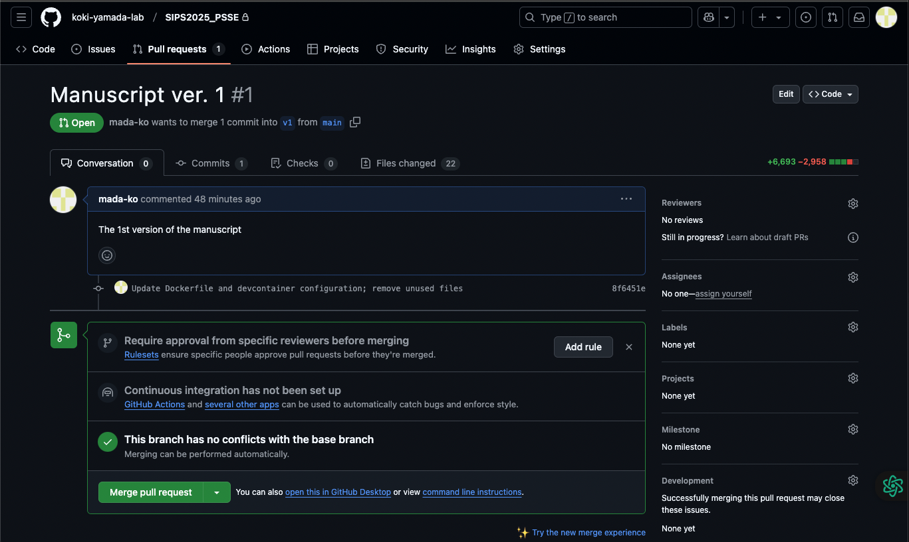

**レビュワーがやること**
レビュワーは，githubのリポジトリのPull Requestにアクセスする．
上の図の`Files changed`をクリックすると`main.tex`等を見ることができるので，そこで原稿に対するコメントを入れていく．
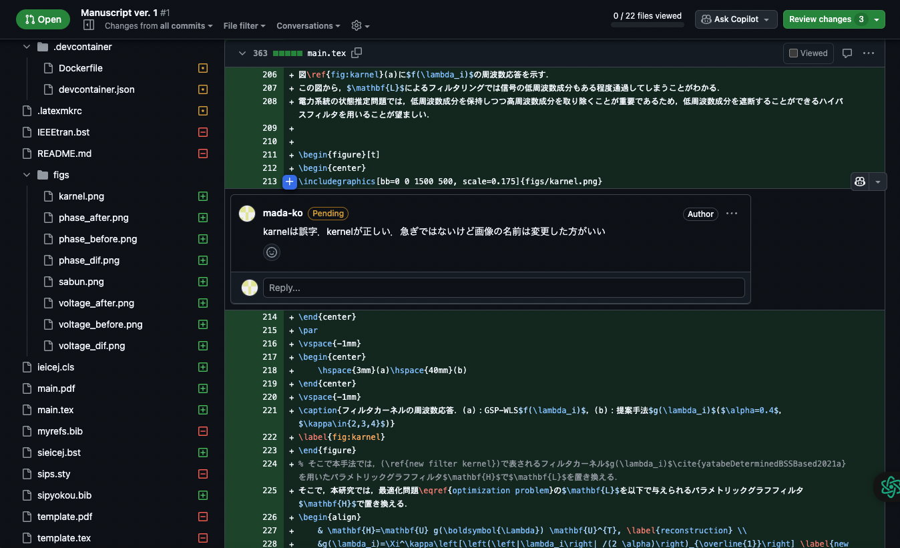
コメントは行番号の横にある`+`マークをクリックすると入れることができる．
> [!TIP]
> `+`マークをドラッグすると複数行に対してコメントすることができる．
> 詳しいコメントの入れ方については[こちら](https://docs.github.com/ja/pull-requests/collaborating-with-pull-requests/reviewing-changes-in-pull-requests/commenting-on-a-pull-request)を参照（変更の提案については`プルリクエストに行コメントを追加` の7に詳しく書いてある）．


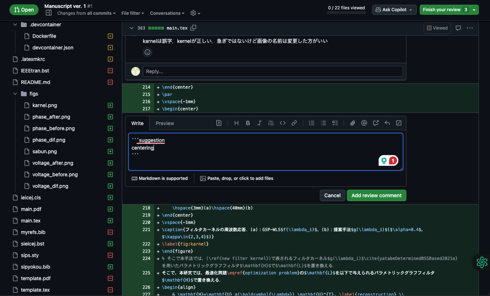

一通りコメントを入れ終えたら，画面右上の緑の`Finish your review`をクリックするとコメントを投稿できる．
> [!WARNING]
> `Finish your review`を押すまでは`pending`状態になっており，誰からもコメントは見られない状態であるので，コメントをし終わったら忘れずに`Finish your review`を押す

レビューが終わるとこのようにコメントが見られるようになる
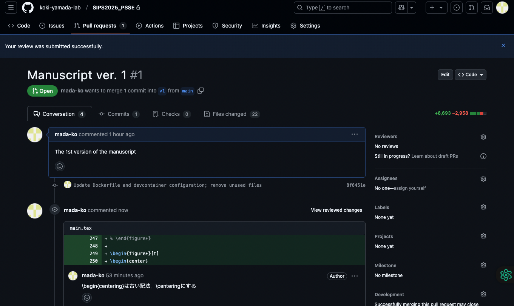


**コメントをもらった後に執筆者がやること**
原稿の著者はコメントを元に，ローカル環境で修正を行い，修正が完了したらまたgithubのリポジトリに変更をpushする．
コメントに対する修正が完了したら，上の図のConversationのところでコメントに対し返信をする（議論が必要なものだけ返信する形でも良い）．コメントされたことについて修正が完了したら，`Resolve conversation`を押す．
そして，またレビュワーにslack等でコメントをお願いする．
これらのやりとりを繰り返し（論文を書くのに慣れてなかったら10回以上かかることも普通），修正コメントがなくなれば，原稿の完成となる．

> [!TIP]
> コメントが多くなりすぎて見づらくなってきたら，pull requestをmergeしてclosedにして，また新しくブランチを作り，pull requestをたてる．その際は，
>```shell
>git branch v2 $(git rev-list --max-parents=0 HEAD | tail -n 1) \
>&& git push origin v2 \
>&& gh pr create --base v1 --head main --title "Manuscript ver. 2" --body "The 2nd version of the manuscript"
> ```
>を実行するとpull requestをたてられる．v1をv2に変更し忘れるとブランチ名が被ってしまい，`main.tex`ファイルの全体がpull requestのレビュワーから見えなくなるので注意する．3回目のpull request時にはv2の部分をv3に変更し，4回目以降も同様です．

